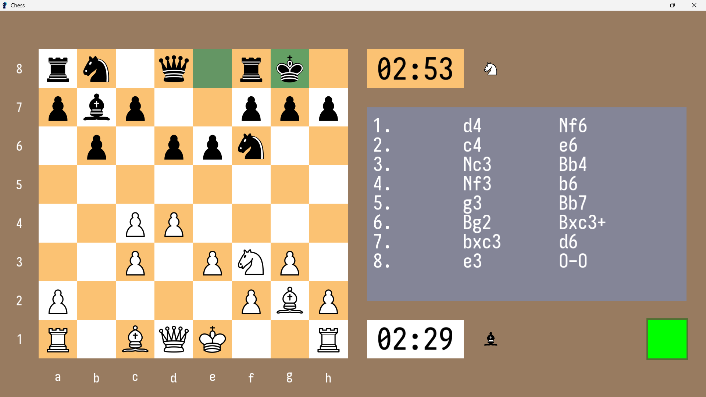

# Chess Engine

An offline, zero-latency chess graphical user interface with a working chess engine opponent built entirely with C++. It uses Simple and Fast Multimedia Library (SFML) for rendering the GUI and syzygy tablebases for perfect endgame execution.



## [ /// THE ENGINE /// ]

1. **Search Architecture**: Utilizes the **Minimax** algorithm heavily optimized with **Alpha-Beta Pruning** to drastically reduce the search tree.

2. **Quiescence Search**: Implemented to mitigate the Horizon Effect, ensuring the engine searches deep into volatile capture sequences before evaluating a position prematurely.

3. **Iterative Deepening**: Allows the engine to dynamically manage its search depth based on the allocated time control, ensuring immediate responses in Blitz/Bullet scenarios.

4. **Custom Opening Book**: The engine's opening is also fueled by a large opening book, which I created with a custom Python script. This script parses millions of chess games, which are from the Lichess Elite Database and Grandmaster Games. This engine is powered by players you may be familiar with, like Magnus Carlsen, Hikaru Nakamura, Bobby Fischer, and many more. The engine uses this opening book for instantaneous opening moves.

5. **Syzygy Endgame Probing**: Integrated with the Fathom C library to probe 5-piece Syzygy tablebases. The engine reads **Win/Draw/Loss** (WDL) tables to evaluate positions, and then it queries **Distance to Zero** (DTZ) metrics to force progress and deliver complex checkmates (such as Knight & Bishop vs. King) without delay.

## [ /// USAGE & CONTROLS /// ]

The graphical interface was designed to be entirely intuitive and completely offline.

### Main Menu & Settings

From the title screen, you can immediately start a game or open the Settings panel to configure the engine's QoL features, including Auto-Promote to Queen, Show Legal Moves, and Fullscreen Mode.

### Match Configuration

Before a game begins, you are routed to the Pre-Play lobby where you can configure the exact parameters of the match. 

- Side: White, Black, or Random.

- Opponent: Play locally against another human, or challenge the Minimax AI.

- Time Control: Select between standard Bullet, Blitz, or Rapid.

- Increment: Add 0, 1, 2, 5, or 10 seconds of increment per move.

### The Gameplay

During the match, the left side of the screen is dedicated to the board, while the right side serves as your HUD.

- Timers & Graveyard: Real-time digital clocks and visual tracking of captured material.

- Move History: A scrollable, dynamically updating log of all played moves in standard algebraic notation.

- Resignation: A dedicated resign button in the bottom right, protected by a two-step confirmation dialogue to prevent accidental clicks.

- Once a game concludes, a pop-up dialogue will tell you the exact reason for the game's end and offer an immediate rematch or a return to the main menu.

## [ /// BUILD INSTRUCTIONS /// ]

If you want to build the program yourself, you will need these prerequisites:

1. CMake v3.16 or higher
2. C++20 Compiler (e.g., GCC, MSVC, Clang)
3. SFML v3.x or higher

### Compiling on macOS / Linux

Unix-based systems can natively resolve SFML if installed via a package manager.

1. Install SFML v3.x using your package manager:

    ```
    macOS: brew install sfml
    ```
    ```
    Ubuntu/Debian: sudo apt-get install libsfml-dev
    ```

2. Clone the repository:

    ```bash
    git clone https://github.com/Proderp/ChessEngine.git
    cd ChessEngine
    ```

3. Generate the build files. You do not need to provide the directory to your SFML on a Unix-based system.

    ```bash
    cmake -B build -DCMAKE_BUILD_TYPE=Release
    cmake --build build
    ```

4. Run the application:

    ```bash
    ./build/ChessEngine
    ```

### Compiling on Windows

1. Clone the repository:
    ```bash
    git clone https://github.com/Proderp/ChessEngine.git
    cd ChessEngine
    ```

2. Generate the build files. For Windows, you must provide CMake with the path to your SFML installation's CMake directory using the -DSFML_DIR flag:

    ```bash
    cmake -B build -DSFML_DIR="C:/path/to/your/SFML/lib/cmake/SFML"
    ```

3. Compile the executable:

    ```bash
    cmake --build build --config Release
    ```

You should now have an executable, but it still needs to be linked. If you are compiling on Windows using dynamic linking, ChessEngine.exe requires the SFML .dll files to run. If you attempt to launch the executable directly and receive a "Missing DLL" error, choose one of the following solutions:

**Option A**: Add the bin directory of your SFML installation (e.g., C:/SFML/bin) to your Windows System PATH environment variable. This allows Windows to locate the .dlls automatically.

**Option B**: Copy `sfml-graphics-3.dll`, `sfml-window-3.dll`, and `sfml-system-3.dll` from your SFML bin directory and paste them directly into your build/Release folder right next to ChessEngine.exe.

Once you have done either option, you can now run ChessEngine.exe by just double-clicking it or running: 

```bash
.\build\Release\ChessEngine.exe
```

## [ /// MOTIVATION /// ]

This project was originally a school project for my first year C++ programming class, which was mostly evaluated on a presentation as well as having a working program. I worked with a team of two other members: Mercer Thantran and Mason Boesche. 

In the process of making this project, I served as the Lead Software Engineer and Sole Architect. I implemented the rendering, engine algorithms, the custom opening book, the syzygy tablebases, designed the GUI, and configured the CMake build system. 

We initially made this project as an advanced project submission for the class. I have now repurposed it to be a project I hope to drastically improve in the future outside of school.

## [ /// AUTHORS /// ]

**Jalwin Grayser Jas Winston** (he/him) - HBSc Computer Science Co-op Program, Lakehead University. Check out my other projects!

**My GitHub**: [My Repositories!](https://github.com/Proderp)

**My LinkedIn**: [LinkedIn](https://www.linkedin.com/in/jalwin-grayser-jas-winston-1103a2401/)

## [ /// ACKNOWLEDGEMENTS /// ]

- [SFML](https://www.sfml-dev.org/) - The underlying C++ multimedia API I used for graphics rendering.
- [PGN Mentor](https://www.pgnmentor.com/) - A wonderful database of PGN files! I used this for thousands of grandmaster games to create my opening book!
- [Lichess Elite Database](https://database.nikonoel.fr/) - Another great tool for accessing millions of online chess games, which I also used for my opening book!
- [Fathom](https://github.com/jdart1/Fathom) - Probes the Syzygy tablebase for WDL and DTZ.
- [Syzygy Tablebase Downloader](https://github.com/jj-jaguar/Syzygy-Tablebase-Downloader) - Allowed me to easily and seamlessly download the Syzygy tablebases. I wouldn't have been able to implement perfect endgames without it!
- [Iosevka Charon](https://github.com/jul-sh/iosevka-charon) - The font I utilized for its perfect fit in this program.

## [ /// LICENSE /// ]

This project is licensed under the MIT License - see the [LICENSE](LICENSE) for details.
